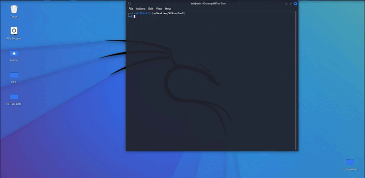

# NET-XU.shell
> NET-XU.shell is a tool that allows you to create reverse shell. and automates the execution of shell commands
 

> NET-XU.shell Next update : powershell to exe 


### Installation

1. Clone the repo
 
   ```sh
   git clone https://github.com/Popps000/NET-XU.shell.git
   ```
2. execution permit
 
   ```sh
   chmod +x NET-XU.shell.sh
   ```
3. Use
 
   ```sh
   sudo ./NET-XU.shell.sh
   ```


