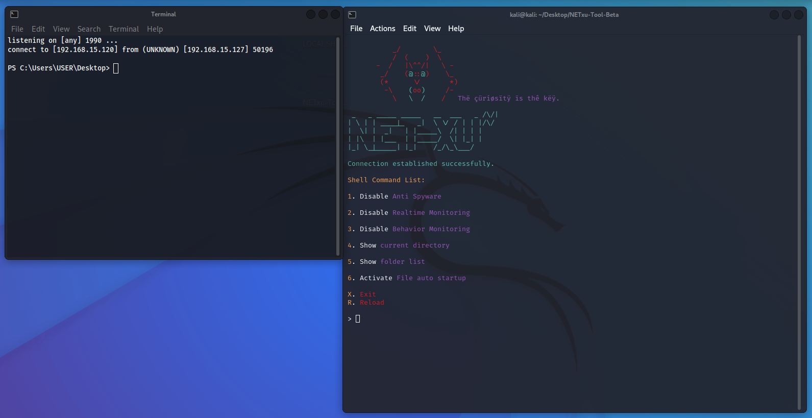

# NET-XU.shell
> NET-XU.shell is a tool that allows you to create reverse shell. and automates the execution of shell commands
 

> NET-XU.shell Version : Beta V0.1

src="https://komarev.com/ghpvc/?username=popps000&label=Profile%20views&color=0e75b6&style=flat"
